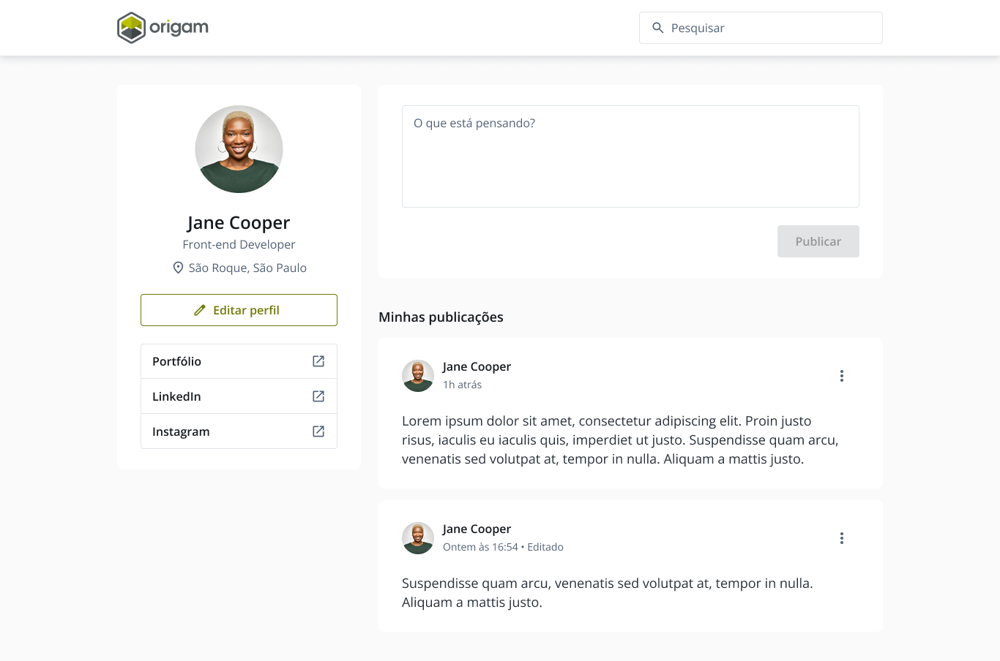

# Front-end Origam Sistemas

> Esse é um pequeno projeto criado como base para a avaliação de habilidades técnicas para
> front-end.

> # Preview

# Proposta de Teste

> Nesse teste você implementará as funcionalidades descritas abaixos. Tenha atenção com as regras de
> negócios definidas mais adiante.

> Lembre-se de seguir o layout proposto
> em https://www.figma.com/design/Bh1uM90Ga8cYQSYsh88lEI/Design?node-id=2-2&t=hGhVd5sunICOUcW3-0. É
> importante se cadastrar no Figma para conseguir inspecionar os elementos

> Versão do Flutter 3.22.1

> Utilizar o Flutter Web

> Caso não consiga concluir todas as funcionalidade, lembre-se que o mais importante é termos noção
> da qualidade do código e de suas habilidades para projeto de sistemas. Nesse caso, complemente sua
> solução com comentários e documentação sobre como terminaria o teste.

> URL da API: https://exam-api.origam.services/

> Documentação da API: https://documenter.getpostman.com/view/30596237/2sA3JRaL28

### Funcionalidades

- Listar todos os posts
- Criar um post
- Atualizar um post
- Remover um post

# Entrega

> No seu github, faça o fork desse repositório, implmente sua solução e nos envie

> Não faça Pull Request para esse repositório.

### Avaliação

- Instruções no README.md
- Lógica de programação
- Qualidade de código
- Qualidade de entrega (como se fosse para produção)

> Plus

- Implementação dos layouts Mobile e Tablet
- Teste unitário e e2e (teste apenas o que achar mais importante).